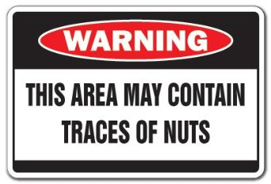

# NutsLogger

Tiny Swift function that allows logging just when running in Debug Mode.

```swift
func nutsLog(@autoclosure message: () -> String) {
    if _isDebugAssertConfiguration() {
        if random() % 50 == 0 {
            print("peanuts trace")
        }
        else {
            print(message())
        }
    }
}
```

### Warning

